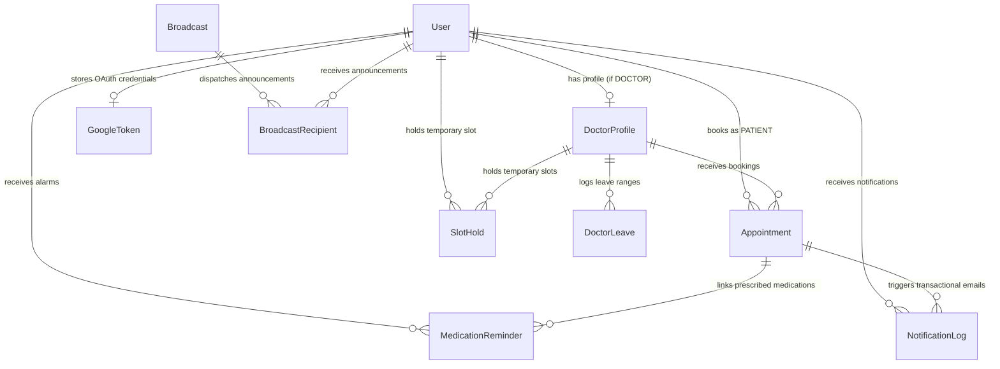

# CareConnect Database Schema Documentation

This document describes the PostgreSQL database schema managed via **Prisma ORM** for the CareConnect SaaS platform.

---

## Entity Relationship Diagram (Mermaid)



---

## Architectural Callouts & Consistency Mechanisms

### 1. Partial Unique Index (`unique_active_doctor_slot`)

To strictly prevent double-booking while preserving appointment audit history, PostgreSQL partial unique indexing is applied to the `Appointment` table:

```sql
CREATE UNIQUE INDEX unique_active_doctor_slot
ON "Appointment" ("doctorProfileId", "appointmentDate", "startTime")
WHERE status IN ('BOOKED', 'COMPLETED');
```

#### Why it exists:
- **Concurrency Defense**: If two patients submit booking requests for the exact same doctor slot simultaneously (down to the millisecond), PostgreSQL enforces row-level exclusivity at the storage engine level. One request succeeds (`HTTP 201 Created`), while the concurrent request fails with `HTTP 409 Conflict`.
- **Cancellation Retention**: Standard full unique indexes (`(doctorProfileId, appointmentDate, startTime)`) block re-booking a slot if a previous appointment was cancelled. The partial index filters on `WHERE status IN ('BOOKED', 'COMPLETED')`, allowing cancelled slots to be immediately re-booked by other patients while retaining full historical cancellation logs.

---

### 2. Slot Hold Mechanism (`SlotHold` Entity)

To prevent race conditions during patient symptom entry and booking wizard navigation, ephemeral slot reservations are managed via the `SlotHold` table:

```prisma
model SlotHold {
  id              String        @id @default(uuid())
  doctorProfileId String
  doctorProfile   DoctorProfile @relation(fields: [doctorProfileId], references: [id], onDelete: Cascade)
  patientId       String
  patient         User          @relation(fields: [patientId], references: [id], onDelete: Cascade)

  appointmentDate DateTime      @db.Date
  startTime       String
  expiresAt       DateTime

  createdAt       DateTime      @default(now())

  @@unique([doctorProfileId, appointmentDate, startTime])
  @@index([expiresAt])
}
```

#### How it works:
- **5-Minute Reservation**: When a patient selects an available slot, a `SlotHold` record is created with `expiresAt = NOW() + 5 minutes`.
- **Unique Constraint**: The `@@unique([doctorProfileId, appointmentDate, startTime])` constraint prevents multiple users from holding the same slot simultaneously.
- **Automatic Expiry & Cleanup**: Unconfirmed holds automatically expire after 300 seconds (`expiresAt <= NOW()`). Available slot queries automatically ignore expired holds.

---

## Core Models Reference

### 1. `User`
Stores system accounts for Patients, Doctors, and Admins.
- `id` (String, PK, UUID)
- `email` (String, Unique)
- `password` (String, bcrypt hashed)
- `role` (Enum: `ADMIN`, `DOCTOR`, `PATIENT`)

### 2. `DoctorProfile`
Holds clinical configuration for doctors.
- `id` (String, PK, UUID)
- `userId` (String, FK -> `User.id`, Unique)
- `specialisation` (String)
- `slotDuration` (Int, default: 30 minutes)
- `workingHours` (Json, `{ start: "09:00", end: "17:00" }`)

### 3. `DoctorLeave`
Tracks admin-approved leave dates for doctors.
- `id` (String, PK, UUID)
- `doctorProfileId` (String, FK -> `DoctorProfile.id`)
- `startDate` (DateTime)
- `endDate` (DateTime)
- `reason` (String, Optional)

### 4. `Appointment`
Core appointment entity with AI pre-visit triage and post-visit clinical notes.
- `id` (String, PK, UUID)
- `patientId` (String, FK -> `User.id`)
- `doctorProfileId` (String, FK -> `DoctorProfile.id`)
- `appointmentDate` (DateTime, `@db.Date`)
- `startTime` (String, e.g. `"10:00"`)
- `endTime` (String, e.g. `"10:30"`)
- `status` (Enum: `BOOKED`, `COMPLETED`, `CANCELLED`)
- `symptoms` (String)
- `urgencyLevel` (Enum: `LOW`, `MEDIUM`, `HIGH`, Optional)
- `chiefComplaint` (String, Optional)
- `suggestedQuestions` (Json, Optional)
- `clinicalNotes` (String, Optional)
- `postVisitSummary` (String, Optional)
- `prescription` (Json, Optional)
- `needsHumanReview` (Boolean, default: `false`)
- `reviewReasons` (Json, Optional)
- `calendarEventId` (String, Optional)

### 5. `MedicationReminder`
Schedules prescription medication alarms.
- `id` (String, PK, UUID)
- `patientId` (String, FK -> `User.id`)
- `appointmentId` (String, FK -> `Appointment.id`, Optional)
- `medicineName` (String)
- `dosage` (String, Optional)
- `frequency` (String)
- `reminderTimes` (Json, e.g. `["08:00", "20:00"]`)
- `startDate` (DateTime, `@db.Date`)
- `endDate` (DateTime, `@db.Date`)
- `isActive` (Boolean, default: `true`)

### 6. `NotificationLog`
Tracks transactional emails and exponential backoff retry schedules.
- `id` (String, PK, UUID)
- `recipientUserId` (String, FK -> `User.id`)
- `type` (Enum: `BOOKING_CONFIRMATION`, `APPOINTMENT_CANCELLATION`, `DOCTOR_LEAVE_CANCELLATION`, `POST_VISIT_SUMMARY`, `MEDICATION_REMINDER`, `SYSTEM_ALERT`, `SYSTEM_ANNOUNCEMENT`)
- `eventKey` (String, Unique) — Enforces notification idempotency.
- `status` (Enum: `PENDING`, `PROCESSING`, `SENT`, `FAILED`)
- `attempts` (Int, default: 0)
- `nextAttemptAt` (DateTime, Optional) — Exponential backoff retry timestamp.

### 7. `GoogleToken`
Stores Google Calendar OAuth 2.0 access and refresh tokens per user.
- `userId` (String, FK -> `User.id`, Unique)
- `accessToken` (String)
- `refreshToken` (String)
- `expiresAt` (DateTime)
